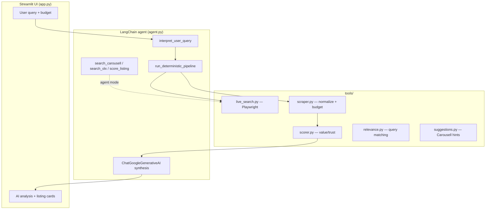

# PriceHunt

AI-powered second-hand shopping assistant for the Philippines. Search **Carousell** and **OLX** in one place, score listings for price and seller trust, and get a **Gemini** buying guide with negotiation drafts.

Built with **LangChain** + **Google Gemini**, **Playwright** live scraping, and a **Streamlit** UI.

---

## Features

- **Natural language search** — English or Taglish (e.g. `ref medyo bago around 5k`, `iPhone 14 under 30k`)
- **Live marketplace data** — Real listings via headless browser (Carousell; OLX PH routes through Carousell)
- **Value & trust scores** — Compare price to session median; flag weak titles, no reviews, risky prices
- **Seller meet-up locations** — Scrapes every meet-up place the seller listed on the listing page
- **AI analysis** — Hybrid mode: live scrape + Gemini summary; optional full agent mode with tools
- **Session memory** — Follow-up questions across searches in one Streamlit session

---

## System architecture



### Request flow (default: hybrid mode)

1. **Parse intent** — `tools/intent.py` extracts product keywords, budget (PHP), and preferences from free text.
2. **Live search** — `tools/live_search.py` opens Carousell in Playwright, scrolls results, extracts cards (title, price, seller, URL).
3. **Enrichment** — Optional: listing pages for **meet-up locations**; optional: seller profiles for ratings/reviews.
4. **Filter & score** — `tools/relevance.py` keeps on-topic listings; `tools/scorer.py` ranks value vs median and trust signals.
5. **AI layer** — `agent.py` sends structured JSON + user message to **Gemini** via LangChain for narrative, top pick, flags, and negotiation text.
6. **Render** — `ui/components.py` + `ui/theme.py` display cards, scores, and links.

### Project layout

| Path | Role |
|------|------|
| `app.py` | Streamlit entrypoint, sidebar toggles, search button |
| `agent.py` | LangChain agent, Gemini synthesis, deterministic pipeline |
| `tools/live_search.py` | Playwright Carousell search, location/seller enrichment |
| `tools/scraper.py` | Search API for agent tools; HTTP fallback |
| `tools/scorer.py` | Per-listing value/trust scores and flags |
| `tools/intent.py` | Taglish/English query parsing |
| `tools/relevance.py` | Title/slug relevance vs search query |
| `tools/suggestions.py` | Carousell autocomplete / top searches |
| `ui/` | Themed listing cards and stats |
| `scripts/` | Local debug probes (not required to run the app) |

---

## Libraries & stack

| Library | Purpose |
|---------|---------|
| [Streamlit](https://streamlit.io/) | Web UI |
| [LangChain](https://python.langchain.com/) | Agent framework, tools, message history |
| [langchain-google-genai](https://pypi.org/project/langchain-google-genai/) | Gemini chat model |
| [Playwright](https://playwright.dev/python/) | Headless browser for live Carousell pages |
| [BeautifulSoup4](https://www.crummy.com/software/BeautifulSoup/) | Legacy HTML parsing fallback |
| [requests](https://requests.readthedocs.io/) | HTTP fallback (often blocked by Carousell) |
| [python-dotenv](https://github.com/theskumar/python-dotenv) | `.env` configuration |
| [Pydantic](https://docs.pydantic.dev/) | Tool input schemas for the agent |

> **Note:** This project uses **LangChain** with a custom tool-calling agent, not CrewAI or AutoGPT. The design is a **hybrid pipeline** (deterministic scrape + LLM synthesis) for reliable data with AI reasoning on top.

---

## Prerequisites

- **Python 3.11+** (3.14 supported in development)
- **Google AI Studio API key** — [Get a key](https://aistudio.google.com/apikey)
- **Chromium** for Playwright (`playwright install chromium`)

---

## Setup

### 1. Clone the repository

```bash
git clone https://github.com/RyElijah/PriceHunt.git
cd pricehunt
```

### 2. Create a virtual environment

```bash
python -m venv .venv

# Windows
.venv\Scripts\activate

# macOS / Linux
source .venv/bin/activate
```

### 3. Install dependencies

```bash
pip install -r requirements.txt
playwright install chromium
```

### 4. Configure environment

Copy the example env file and add your Gemini key:

```bash
copy .env.example .env   # Windows
# cp .env.example .env   # macOS / Linux
```

Edit `.env`:

```env
GOOGLE_API_KEY=your_gemini_api_key_here
GEMINI_MODEL=gemini-2.5-flash
PRICEHUNT_USE_PLAYWRIGHT=1
```

| Variable | Description |
|----------|-------------|
| `GOOGLE_API_KEY` | Required for AI analysis |
| `GEMINI_MODEL` | Default `gemini-2.5-flash` |
| `PRICEHUNT_USE_PLAYWRIGHT` | `1` = live browser search |
| `PRICEHUNT_SELLER_PROFILES` | `1` = fetch seller star ratings (slower) |
| `PRICEHUNT_FETCH_LOCATIONS` | `1` = fetch meet-up locations from listing pages |

### 5. Run the app

```bash
streamlit run app.py
```

Open the URL shown in the terminal (usually `http://localhost:8501`).

---

## Usage

1. Enter a product (e.g. `iPhone 14`) or a full request in Taglish/English.
2. Set **max budget (₱)** — phones often need ₱40k–₱60k+ to see results.
3. Click **Search** — live listings load first, then Gemini writes the analysis.
4. Sidebar:
   - **Live search** — turn off only for debugging
   - **Meet-up locations** — seller meet-up places (recommended on)
   - **Seller ratings** — slower; optional

First search typically takes **15–40s** depending on toggles; repeat queries may be faster due to in-memory caching.

---

## AI modes

| Mode | Behavior |
|------|----------|
| **Hybrid** (default) | Live scrape → score → Gemini writes analysis from real JSON |
| **Agent** | Gemini calls `search_carousell`, `search_olx`, and `score_listing` tools directly |

Hybrid is recommended for accurate listing data.

---

## Publishing to GitHub

From the project folder:

```bash
git init
git add .
git commit -m "Initial commit: PriceHunt AI shopping assistant"
git branch -M main
git remote add origin https://github.com/YOUR_USERNAME/pricehunt.git
git push -u origin main
```

**Before you push:** ensure `.env` is not committed (it is listed in `.gitignore`). Only share `.env.example`.

Create the repo on GitHub first: **New repository** → name it (e.g. `pricehunt`) → do not add a README if you already have one locally → use the commands above.

---

## Limitations & ethics

- Scraping depends on Carousell’s site structure; selectors may need updates if the site changes.
- Respect Carousell/OLX terms of service; use reasonable request rates (built-in throttling and caching).
- Listings are third-party; always verify on the official listing page before paying.
- AI advice is not a guarantee of safety or legality of a deal.

---

## Project documentation (course submission)

| Document | Path |
|----------|------|
| **Project report (5–8 pages)** | [`docs/PROJECT_REPORT.md`](docs/PROJECT_REPORT.md) → export to PDF |
| **Demo video script (3–5 min)** | [`docs/DEMO_VIDEO_SCRIPT.md`](docs/DEMO_VIDEO_SCRIPT.md) |
| **Submission checklist** | [`docs/SUBMISSION_CHECKLIST.md`](docs/SUBMISSION_CHECKLIST.md) |

---

## License

Add your chosen license (e.g. MIT) in a `LICENSE` file if you publish publicly.

---

## Troubleshooting

| Issue | Fix |
|-------|-----|
| No listings | Raise budget; enable **Live search**; run `playwright install chromium` |
| Gemini 404 / quota | Set `GEMINI_MODEL=gemini-2.5-flash` in `.env` |
| Slow searches | Turn off **Seller ratings**; keep one search per query (cache helps repeats) |
| Wrong / empty locations | Enable **Meet-up locations**; some sellers only list places after expanding on Carousell |
